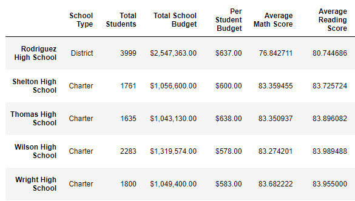

# School District Analysis
## Overview of the School District Analysis
Initially data from a school district was cleaned, formatted into tables and then analyzed.  Reading and testing scores for students from fifteen schools in a district were combined with budget, school size and school type data.  Tables were created to show the top 5 and bottom 5 performing schools, the average math and reading scores for students at each grade level, school performance based on budget, school performance based on school size, and school performance based on type of school.  

After the analysis was completed it was discovered that some of the data had been altered prior to being analyzed.  Specifically, the reading and writing scores for the ninth grade students at Thomas High School were suspect.  To remedy this, all ninth grade scores from Thomas High School were removed from the data set and the calculations and tables created were re-created.  The affect this change had on the conclusions drawn about the district, schools as a whole, and Thomas High School are discussed below.    

## Results
After revising the data, a comparison of the initial and final data sets was performed to see how each of the seven school district metrics was affected.  Below is a bulleted summary of the changes.
* Affect on District Summary - there is only one minor change to the data.  The average math scores of the district were lowered from 79.0 to 78.9.  The screenshots below show the initial and final district summaries.  

 

 
* Affect on School Summary - of the fifteen schools evaluated, only the data of Thomas High School was affected.  This makes sense as it was the only school where numbers were deleted.  Specifically, the average math and reading scores changed slightly, one lowering and one raising a little bit, respectively.  The screenshots below show the initial and final school summaries and how no other school besided Thomas High School was affected.

 

* Affect on Thomas High School - while there were slight changes to the test scores of Thomas High School, the deletion of the ninth grade data did not affect its ranking when compared to other schools.  Thomas High School was the second best school in the district both before and after removal of the data.  A screenshot showing the the top five school rankings is below.

* Math and reading scores by grade - of the fifteen schools evaluated, only the scores by grade data of Thomas High School was affected.  Once again, this makes sense as it was the only school where numbers were deleted.  In the screenshots below, it can be seen that the ninth grade students of Thomas High School intially have data and then in the next screenshot where the data is removed and replace by nan (not a number) values. 

* Scores by school spending
* Scores by school size
* Scores by school type

## Summary
Several changes occurred to the data after the reading and math scores for the ninth grade students of Thomas High School were replaced.  First,...

 

