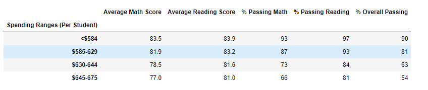

# School District Analysis
## Overview of the School District Analysis
Initially data from a school district was cleaned, formatted into tables and then analyzed.  Reading and testing scores for students from fifteen schools in a district were combined with budget, school size and school type data.  Tables were created to show the top 5 and bottom 5 performing schools, the average math and reading scores for students at each grade level, school performance based on budget, school performance based on school size, and school performance based on type of school.  

After the analysis was completed, it was discovered that some of the data had been altered prior to being analyzed.  Specifically, the reading and writing scores for the ninth grade students at Thomas High School were suspect.  To remedy this, all ninth grade scores from Thomas High School were removed from the data set and the calculations and tables created were re-created.  The affect this change had on the conclusions drawn about the district, schools as a whole, and Thomas High School are discussed below.    

## Results
After revising the data, a comparison of the initial and final data sets was performed to see how each of the seven school district metrics was affected.  Below is a bulleted summary of the changes.
* Effect on District Summary - there is only one minor change to the data.  The average math scores of the district were lowered from 79.0 to 78.9.  The screenshots below show the initial and final district summaries.  

 

 
* Effect on School Summary - of the fifteen schools evaluated, only the data of Thomas High School was affected.  This makes sense as it was the only school where numbers were deleted.  Specifically, the average math and reading scores changed slightly, one lowering and one raising a little bit, respectively.  The screenshots below show the initial and final school summaries and how no other school besided Thomas High School was affected.

 

* Effect on Thomas High School - while there were slight changes to the test scores of Thomas High School, the deletion of the ninth grade data did not affect its ranking when compared to other schools.  Thomas High School was the second best school in the district both before and after removal of the data.  A screenshot showing the top five school rankings is below.

* Math and reading scores by grade - of the fifteen schools evaluated, only the scores by grade data of Thomas High School was affected.  Once again, this makes sense as it was the only school where numbers were deleted.  In the screenshots below, it can be seen that the ninth grade students of Thomas High School initially have data and then in the next screenshot when the data has been removed the ninth grade students have a nan (not a number) value. 

* Scores by school spending - because the deletion of the ninth grade student scores had a very small affect on the overall performance of Thomas High School, there was no change to the scores aggregated by school spending.  A screenshot below shows this data, which was unaffected by the data deletion.

* Scores by school size - similar to the scores by school spending, there is no change to the scores compared to school size.  Once again, since the performance of Thomas High School was only slightly affected, its effect on the group of schools as a whole was negligible.  A screenshot below shows the student scores compared to school size.

* Scores by school type - there is no change to the scores by school type.  As before, the deletion of data had little effect on Thomas High School and hence had negligible effect on all of the schools' combined data.  Below is a screenshot showing student test score performance when separated by public or charter schools.  

## Summary
Overall, the changes caused by the deletion of academically dishonest data were minor and did not have any affect when looking at the aggregate school data as a whole.  However, several minor changes did occur to the data after the reading and math scores for the ninth grade students of Thomas High School were replaced and these should be noted.  First, the average math score of the district was lowered by a tenth of a point.  Second, reading scores for the ninth grade students of Thomas High School have been replaced by nan values.  Third, math scores for the ninth grade students of Thomas High School have been replaced by nan values.  Fourth, both the average math and reading scores of Thomas High School as a whole have been slightly changed due to the deletion of data.  No other school data was affected by the deletion.   

 
